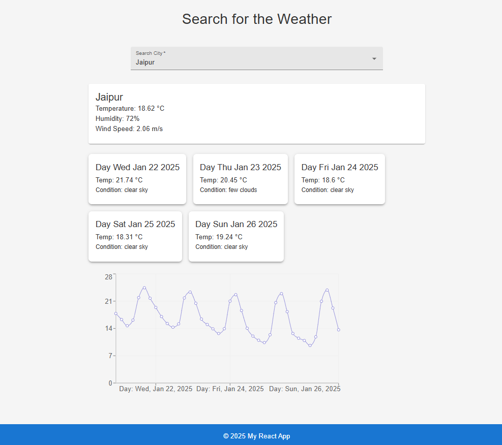

# Weather Dashboard

A responsive web application built with **React**, **Material-UI**, and **Vite** to display real-time weather information for cities around the world. The application fetches data from the OpenWeatherMap API and provides current weather details along with a 5-day forecast.

## Features

- **Search Functionality**: 
  - Search for cities to get weather details.
  - Autocomplete feature for user-friendly search.

- **Current Weather**:
  - Displays temperature, humidity, wind speed, and weather conditions for the selected city.

- **5-Day Forecast**:
  - Shows daily weather forecasts with temperature trends and conditions.

- **Data Visualization**:
  - Graphical representation of temperature trends using `TemperatureChart`.

- **Responsive Design**:
  - Mobile-friendly UI built using Material-UI's grid system.

- **Error Handling**:
  - Handles errors like invalid city names or API issues gracefully.

---

## Project Structure

```plaintext
src
├── components
│   ├── CurrentWeather.jsx       # Displays current weather information
│   ├── Forecast.jsx             # Displays 5-day weather forecast
│   ├── SearchBar.jsx            # Autocomplete search for city names
│   ├── TemperatureChart.jsx     # Displays temperature trend chart
├── hooks
│   ├── useWeatherChart.js       # Custom hook for temperature chart data
├── pages
│   ├── HomePage.jsx             # Main page with weather details and forecast
├── services
│   ├── weatherService.js        # API calls to fetch weather data
├── styles
│   ├── theme.js                 # Custom Material-UI theme
├── App.jsx                      # Root component
├── index.jsx                    # Entry point
└── README.md                    # Project documentation
```

---

## Technologies Used

- **React**: Front-end framework for building the UI.
- **Material-UI**: For responsive and modern UI components.
- **Vite**: For faster development and build performance.
- **OpenWeatherMap API**: To fetch real-time weather data.
- **Axios**: For making API requests.
- **Chart.js**: For visualizing temperature trends.

---

## Prerequisites

1. **Node.js**: Ensure you have Node.js installed.
2. **API Key**: Sign up on [OpenWeatherMap](https://openweathermap.org/) and generate a free API key.

---

## Installation

1. Clone the repository:
   ```bash
   git clone https://github.com/mohan-marwari/Weather-Dashboard.git
   cd Weather-Dashboard
   ```

2. Install dependencies:
   ```bash
   npm install
   ```

3. Create a `.env` file in the root directory:
   ```plaintext
   VITE_WEATHER_API_KEY=your_actual_api_key
   ```

4. Start the development server:
   ```bash
   npm run dev
   ```

5. Open your browser and navigate to:
   ```
   http://localhost:5173
   ```

---

## Usage

1. Use the search bar to find the weather for a specific city.
2. View the current weather details.
3. Explore the 5-day forecast to see future weather trends.
4. Visualize temperature changes using the temperature chart.

---

## Screenshots

### Home Page


---

## Known Issues

- The free API key from OpenWeatherMap supports only a 5-day forecast.
- Limited number of API requests per minute. Upgrade to a paid plan for higher limits.

---

## Future Improvements

- Add user authentication to save favorite cities.
- Implement multilingual support.
- Display weather alerts or notifications for extreme conditions.

---

## License

This project is licensed under the [MIT License](LICENSE).

---

## Author

- **Mohan Marwari**  
  [GitHub](https://github.com/mohan-marwari) | [LinkedIn](https://linkedin.com/in/mohan-marwari)
